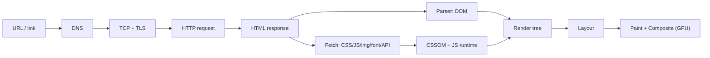
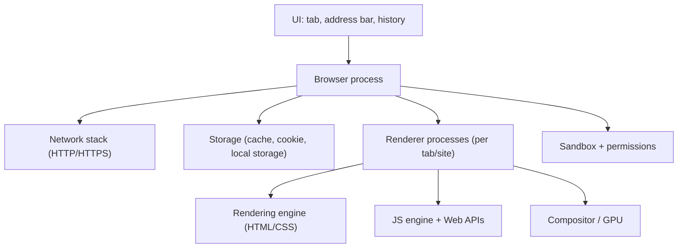
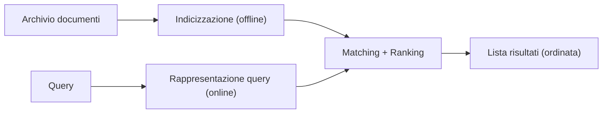
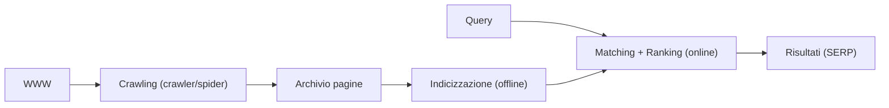
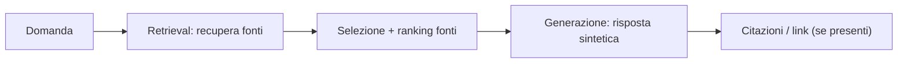
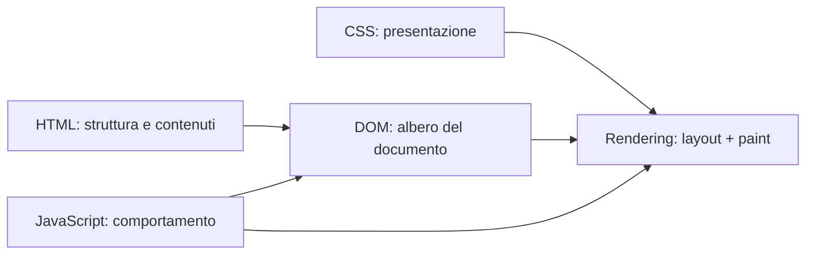

# GESTIONE DELL'INFORMAZIONE IN RETE: STRUMENTI E STRATEGIE
## Università Cattolica

- **Facoltà:** Lettere e Filosofia
- **Corso:** Laurea triennale in Linguaggi dei Media
- **Docente:** Cremaschi Marco
- **Formato:** Lezione + laboratorio

Premi spazio per iniziare.

<!--
Relatore:
- Apri con “perché oggi”: overload informativo + AI → serve metodo.
- Obiettivo del corso: ricerca verificabile + pubblicazione web (HTML/CSS) + uso critico dell’AI.
- Output finale: elaborato HTML/CSS + fonti + metodo esplicito (replicabile).
- Nota: le slide “Dal web” sono riferimenti autorevoli, non vanno lette tutte in aula.
-->

---
layout: none
class: lesson-cover-slide
lesson: 1
lessonTone: indigo
lessonCover: true
---

<LessonCover :lesson="1" title="Introduzione del corso" tone="indigo" />

---
transition: slide-up
class: bg-indigo-100
lesson: 1
lessonTone: indigo
---

# Lezione 1: Introduzione del corso

Questo corso unisce metodo umanistico e strumenti digitali per passare dalla ricerca delle fonti alla pubblicazione di contenuti web affidabili.

## In questa lezione

1. Obiettivi e risultati attesi.
2. Programma e modalità didattica.
3. Criteri di valutazione.
4. Calendario e strumenti consigliati.

<!--
Relatore:
- Obiettivo: chiarire aspettative, modalità e criteri prima di iniziare i contenuti tecnici.
- Messaggio chiave: l’AI accelera, ma senza verifica aumenta errori → il corso allena un metodo.
- Suggerisci come studiare: tenere un quaderno di “procedure” (query, prompt, fonti, decisioni).
-->

---
transition: fade
---

# Perché questo corso oggi

## Contesto

- L'informazione online cresce più velocemente della nostra capacità di verificarla.
- L'AI accelera la ricerca, ma senza metodo aumenta il rischio di errori e superficialità.
- Le competenze richieste oggi sono ricerca, valutazione critica e produzione digitale.


## Direzione del corso

- Ricerca bibliografica classica e avanzata.
- Uso ragionato di chatbot e motori semantici.
- Impiego di workflow RAG e strumenti di supporto.
- Scrittura web in HTML e CSS.

**Obiettivo operativo:** trasformare una ricerca in un prodotto digitale chiaro, verificabile e difendibile.

---
transition: slide-left
---

# Lezione 1: Obiettivi del corso

## Obiettivi formativi

1. Consolidare le basi su Internet e World Wide Web.
2. Imparare strategie di ricerca avanzata, replicabile e documentata.
3. Integrare strumenti AI nella scoperta della letteratura con verifica critica.


## Obiettivi applicativi

1. Produrre contenuti digitali in HTML/CSS pronti per la pubblicazione.
2. Migliorare chiarezza, precisione e accessibilità dei testi.
3. Costruire un metodo personale trasferibile ad altri corsi e contesti professionali.

---
transition: slide-left
---

# Lezione 1: Risultati di apprendimento attesi

## Alla fine del corso saprai

- Usare operatori avanzati e filtri in modo strategico.
- Valutare fonti accademiche e fonti web con criteri espliciti.
- Progettare prompt efficaci e controllare la qualità degli output AI.


## Evidenze concrete di competenza

- Workflow di ricerca documentato.
- Produzione di contenuti web leggibili e accessibili.
- Capacità di motivare scelte metodologiche e strumenti usati.

---
transition: slide-up
---

# Lezione 1: Programma del corso

## Moduli teorico-metodologici

1. Anatomia di Internet: DNS, HTTP/HTTPS, codifiche e rappresentazione digitale.
2. Ricerca web classica e avanzata: operatori, filtri, ricerca inversa, riproducibilità.


## Moduli su AI e fonti

3. AI per la scoperta della letteratura: chatbot, motori semantici, RAG.
4. Ecosistemi informativi accademici: servizi bibliotecari UCSC, SBN, ACNP, DOAJ, Scopus, Crossref.

---
transition: slide-up
---

# Lezione 1: Programma applicativo

## Laboratorio

1. Zotero, organizzazione riferimenti, deduplicazione e citazioni.
2. Scrittura digitale con HTML5 semantico e CSS moderno.


## Competenze operative

1. Uso di assistenti alla programmazione per generazione, debugging e refactoring.
2. Accessibilità, diritto d'autore e uso responsabile delle fonti.
3. Produzione finale: contenuto digitale completo con metodo esplicito.

---
transition: fade-out
---

# Lezione 1: Didattica del corso

## Come lavoreremo

- Lezioni brevi sui concetti chiave.
- Esercitazioni guidate in aula.
- Attività individuali e in piccoli gruppi.
- Analisi di casi reali.


## Supporto e materiali

- Materiali e consegne su Blackboard.
- Feedback continuo su metodo, fonti e chiarezza dei risultati.
- Integrazione costante tra teoria e pratica.

---
transition: slide-left
---

# Lezione 1: Metodo e criteri di valutazione

## Attività finale

- Elaborato in HTML/CSS da caricare su Blackboard almeno 7 giorni prima dell'esame.

## Criteri di valutazione

- Presenza degli elementi richiesti.
- Correttezza tecnica del codice.
- Qualità del design e della scrittura.
- Coerenza tra fonti, metodo e argomentazione.

## Regola di frequenza

- Presenza inferiore al 50%: accesso all'esame come non frequentante.

---
transition: slide-left
---

# Lezione 1: Frequentanti e non frequentanti


## Percorso frequentanti

1. Partecipazione attiva a lezioni e laboratori.
2. Consegna dell'attività pratica finale.
3. Valutazione su metodo, esecuzione e qualità dell'elaborato.


## Percorso non frequentanti

1. Colloquio orale sui contenuti teorici.
2. Uso di strumenti online per ricerca e catalogazione.
3. Ricerca bibliografica su tema a scelta.
4. Presentazione orale dei risultati con slide.

---
transition: fade-out
---

# Lezione 1: Calendario lezioni (1/2)

- 26 Febbraio, 08:30 - 11:30, SA.006 (Sala PC)
- 05 Marzo, 08:30 - 11:30, SA.006 (Sala PC)
- 12 Marzo, 08:30 - 11:30, SA.006 (Sala PC)
- 19 Marzo, 08:30 - 11:30, SA.006 (Sala PC)
- 26 Marzo, 08:30 - 11:30, SA.006 (Sala PC)

---
transition: fade-out
---

# Lezione 1: Calendario lezioni (2/2)

- 16 Aprile, 08:30 - 11:30, SA.006 (Sala PC)
- 23 Aprile, 08:30 - 11:30, SA.006 (Sala PC)
- 30 Aprile, 08:30 - 11:30, SA.006 (Sala PC)
- 07 Maggio, 08:30 - 11:30, SA.006 (Sala PC)
- 14 Maggio, 08:30 - 11:30, SA.006 (Sala PC)

> Il calendario può subire aggiornamenti: fa fede la comunicazione ufficiale su Blackboard.

---
transition: slide-up
---

# Lezione 1: Strumenti consigliati (1/2)

## Ricerca e verifica

- Cataloghi accademici e banche dati bibliografiche.
- Operatori avanzati e triage delle fonti.
- Tracciamento delle fonti usate.

## AI assistita

- ChatGPT, Perplexity, Claude, Elicit.
- Prompt strutturati e controllo delle citazioni.

---
transition: slide-up
---

# Lezione 1: Strumenti consigliati (2/2)

## Produzione contenuti

- HTML5 semantico e CSS moderno.
- Accessibilità e leggibilità dei testi.

## Workflow personale

- Documentare passaggi e decisioni.
- Revisionare output AI prima della consegna.
- Versionare i materiali in modo ordinato.

---
transition: slide-left
---

# Dal web: strumenti e risorse (autorevoli)

- Zotero (reference manager): [zotero.org](https://www.zotero.org/)
- DOAJ (open access journals): [doaj.org](https://doaj.org/)
- Crossref (metadati DOI): [crossref.org](https://www.crossref.org/)
- Creative Commons (licenze): [creativecommons.org/choose](https://creativecommons.org/choose/)
- Google Scholar (ricerca accademica): [scholar.google.com](https://scholar.google.com/)

---
transition: fade
---

# Domande?

Ogni modulo è pensato per essere applicabile a studio, ricerca e lavoro.

**Docente:** Cremaschi Marco

<!--
Relatore (chiusura):
- Verifica che sia chiaro: consegna finale, scadenze, criteri.
- Domande guida: “cosa vi preoccupa di più: ricerca, AI o codice?”.
- Mini-compito: installare Zotero + creare una raccolta “Gestione web” + salvare 3 fonti del proprio interesse.
-->

---
layout: none
class: lesson-cover-slide
lesson: 2
lessonTone: sky
lessonCover: true
---

<LessonCover :lesson="2" title="Il Browser" tone="sky" />

---
transition: slide-left
class: bg-sky-100
lesson: 2
lessonTone: sky
---

# Lezione 2: Il Browser

Per capire la rete, dobbiamo capire lo strumento che la rende visibile.

<!--
Relatore:
- Hook: il browser è il “sistema operativo” del web: rete + sicurezza + UI + storage.
- Anticipa il laboratorio: useremo DevTools (Network + Storage) per vedere cosa succede davvero.
- Nota sul lessico: agenti/automazione ≠ magia → servono permessi, policy, audit.
-->

---
transition: fade
---

## In questa lezione

1. Che cos'è un browser (e cosa fa davvero).
2. Come una pagina web arriva sullo schermo.
3. Architettura, estensioni, sincronizzazione.
4. Privacy: tracking, fingerprinting, rischi reali.
5. Nuovi browser *agentici* e scenari futuri.

<!--
Relatore (scansione consigliata, ~60–75 min):
- 15' “cosa fa un browser” + pipeline (da URL a pixel).
- 15' architettura (processi) + estensioni/sync.
- 15' privacy: terze parti, fingerprinting, anti-tracking.
- 10' agentic browsers + implicazioni.
- 15' mini-lab + confronto finale.
Se sei corto: riduci la parte “futuro” e vai al mini-lab.
-->

---
transition: slide-up
---

# Perché il browser è centrale

- È il **mediatore** tra te e le fonti: decide *cosa* carichi e *come* lo vedi.
- Ogni pagina è un **assemblaggio**: contenuti + script + servizi esterni.
- La ricerca online passa da qui: history, cache, suggerimenti, personalizzazione.
- Le scelte del browser influenzano privacy, sicurezza, accessibilità e qualità dell'informazione.

---
transition: fade
---

# Una pagina web non è "un file"

Una pagina moderna aggrega risorse e servizi, spesso da domini diversi:

- HTML (struttura)
- CSS (stile)
- JavaScript (comportamento)
- immagini / video / font
- chiamate API (dati)
- iframe e embed (mappe, social, analytics, ads)

> Implicazione: valutare una fonte significa anche osservare **da dove arriva** ciò che stai vedendo.

---
transition: slide-left
---

# Dal click al pixel (mappa mentale)



---
transition: slide-left
---

# Oggetti embedded e widget

## Oggetti "embedded"

Elementi incorporati nella pagina (es. video, mappe, post social, commenti).

## Widget (in generale)

- Elementi dell'interfaccia che mostrano info e invitano ad azioni.
- Piccole "app" dentro o accanto a un'app più grande.
- Spesso portano con se script, tracker e richieste di rete.

---
transition: slide-up
---

# Iframe: utili, ma delicati

- Permettono di incorporare contenuti esterni (es. player video, mappe, social).
- Separano (in parte) contesti e permessi, ma non eliminano i rischi.
- Possono introdurre:
  - tracciamento di terze parti
  - problemi di performance
  - superfici di attacco aggiuntive

Regola pratica: quando valuti una pagina, chiediti **cosa viene da fuori**.

---
transition: fade
---

# Architettura del browser (semplificata)



Obiettivo: isolare i siti tra loro, ridurre danni, mantenere reattività.

---
transition: slide-left
---

# Le "browser wars" (idea chiave)

- Controllare il browser dominante significa influenzare:
  - standard (o estensioni proprietarie)
  - dati e metriche d'uso
  - default (motore di ricerca, servizi, account)
- Strategie tipiche:
  - gratuito + aggiornamenti rapidi
  - funzionalità "killer"
  - integrazione con ecosistemi (sync, store, AI)

---
transition: slide-up
---

# Standard e interoperabilità

Per evitare "funziona solo su X", servono standard e test.

- Standard: HTML, CSS, JS, Web APIs, sicurezza.
- Conformità: quanto un browser implementa correttamente le specifiche.
- Compatibilità: quanto un sito rende bene su browser diversi.

Strumenti utili:
- Validator HTML: [validator.w3.org](https://validator.w3.org/)
- "Can I use": [caniuse.com](https://caniuse.com/)
- Web Platform Tests: [web-platform-tests.org](https://web-platform-tests.org/)

---
transition: slide-up
---

# Motori: famiglie di browser

Quando diciamo "browser", spesso intendiamo un ecosistema basato su un **motore**.

- Rendering engine (HTML/CSS):
  - Blink (Chromium)
  - WebKit (Safari)
  - Gecko (Firefox)
- JavaScript engine:
  - V8 (Chromium)
  - JavaScriptCore (Safari)
  - SpiderMonkey (Firefox)

Implicazione: testare su "Chrome e basta" non equivale a testare sul Web.

---
transition: slide-left
---

# Interfaccia: da finestre a "sistema operativo"

Evoluzione tipica:

1. Più finestre (storie separate)
2. Tabbed browsing (una storia comune + gestione migliore)
3. Omnibox (URL + ricerca nello stesso spazio)
4. Multi-process (stabilità: un tab che crasha non "butta giù" tutto)

Idea di fondo: il browser come **ambiente di lavoro** (quasi un OS).

---
transition: fade
---

# Dati nel browser: cosa resta (e perché conta)

- History e cache: accelerano, ma raccontano abitudini.
- Cookie e storage: sessioni, preferenze, tracking.
- Password e autofill: comodità, ma superficie critica.
- Sync: porta tutto su più dispositivi (e spesso su cloud del vendor).

Domanda utile: *dove sono i miei dati, e chi li può leggere?*

---
transition: slide-up
---

# Estensioni: superpoteri (e rischi)

## Cosa sono

Componenti aggiuntivi che usano API del browser per aggiungere funzioni.

## Perché sono potenti

- cambiano pagine, richieste, permessi, UI
- automatizzano compiti (cattura fonti, note, blocchi, traduzioni)

## Rischi

- permessi eccessivi
- supply chain (update malevoli)
- raccolta dati

Regola: poche estensioni, scelte bene, permessi minimi.

---
transition: slide-left
---

# Privacy: problemi tipici (da conoscere)

- Cookie di tracciamento e third-party tracking
- Fingerprinting (device e browser "unici" senza cookie)
- Tracciamento del motore di ricerca (query e interessi)
- Telemetria del browser (diagnostica, miglioramento, marketing)
- Vulnerabilità e attacchi via web (phishing, exploit, drive-by)
- Estensioni invasive

Non è paranoia: è **modellazione del rischio**.

---
transition: slide-up
---

# Privacy: impostazioni minime consigliate

- Aggiorna sempre il browser (patch veloci = sicurezza).
- Disattiva cookie di terze parti (o limita tracciamento).
- Controlla permessi sito-per-sito (camera, mic, geoloc, notifiche).
- Usa profili separati (studio/lavoro/personale).
- Verifica estensioni e rimuovi il superfluo.
- Usa HTTPS-only dove disponibile.

---
transition: fade
---

# "Nuovi" browser: si parte quasi sempre da un motore esistente

Fare un browser completo è costoso: oggi spesso si costruisce su motori come Chromium.

Motivazioni comuni:
- privacy (blocco tracker/ads, modalità più rigorose)
- produttività (tab management, note, workflow)
- modelli di business alternativi

Esempi noti: Vivaldi, Brave (oltre ai "classici" Chrome/Edge/Firefox/Safari).

---
transition: slide-left
---

# Browser agentici: cosa intendiamo

Differenza pratica:

- **Assistente**: risponde, riassume, spiega (tu fai i click).
- **Agente**: pianifica e **agisce** sul web (click, form, navigazione, estrazione dati).

Un browser agentico integra (o collega) un modello AI a strumenti di:
- navigazione controllata
- lettura DOM e/o visione (screenshot)
- esecuzione di azioni con permessi
- memoria/cronologia del task

---
transition: slide-left
---

# Esempi e pattern (oggi)

Non serve un "nuovo browser" per avere funzioni agentiche: spesso arrivano come feature.

- **Assistenti integrati** (riassunti, scrittura, ricerca guidata) in alcuni browser mainstream.
  - Esempi indicativi: Edge (Copilot), Opera (Aria), Brave (Leo), Arc (Max).
- **Browser orientati a privacy/produttività** con AI/automazioni (spesso su base Chromium).
- **Estensioni** che aggiungono estrazione dati, note, citazioni, traduzioni.
- **Modalità agente**: strumenti che pilotano la navigazione per completare task multi-step.

Obiettivo didattico: riconoscere *che tipo di delega* stai facendo (suggerimento vs azione).

---
transition: slide-up
---

# Perché cambiano il modo di "cercare"

Nel lavoro su fonti, un agente può:

- fare triage (ridurre 50 risultati a 10 buoni, con criteri espliciti)
- confrontare pagine e trovare differenze
- estrarre citazioni e dati in tabelle
- costruire una bibliografia (da verificare)
- ripetere procedure (replicabilità)

Ma: l'agente può sbagliare. Il metodo resta umano.

---
transition: slide-left
---

# Rischi specifici dei browser agentici

- **Prompt injection**: una pagina può "istruire" l'agente a fare cose non desiderate.
- **Esfiltrazione dati**: l'agente vede pagina, form, talvolta credenziali.
- **Azioni irreversibili**: acquisti, invii, modifiche.
- **Allucinazioni operative**: crede di aver cliccato o capito, ma non è vero.
- **Ambiguità di responsabilità**: chi ha fatto cosa? serve logging.

---
transition: fade
---

# Regole pratiche (classe / lavoro)

1. Usa un **profilo dedicato** per agenti/AI (separato da account personali).
2. Richiedi conferma per azioni critiche (invio, pagamento, modifica).
3. Mantieni un log: query, passaggi, URL, timestamp.
4. Verifica su fonti primarie (soprattutto numeri, citazioni, policy).
5. Limita permessi e dati condivisi (principio del minimo privilegio).

---
transition: slide-up
---

# Futuro dei browser (ipotesi ragionate)

1. Più AI *on-device* per privacy e latenza (meno dipendenza dal cloud).
2. Browser come "runtime" per agenti: task, memoria, strumenti, audit.
3. Nuovi standard per automatizzare in modo sicuro (permessi, attestazioni, log).
4. Identità più forte (passkey, credenziali verificabili) e meno password.
5. Web più "anti-abuso": più segnali contro bot, frodi, scraping indiscriminato.

---
transition: slide-left
---

# Scenario possibile: web a due livelli

- Interfacce per umani (visuali, persuasive, pubblicitarie).
- Strati per macchine/agenti (dati strutturati, API, feed, schema).
- Nuove frizioni: captcha, paywall, rate limit, permessi, "agent mode".

Domanda di metodo: come mantenere **trasparenza** e **verificabilità** quando un agente media tutto?

---
transition: fade
---

# Mini-lab (15 minuti)

Scegli un sito di notizie o un articolo.

1. Apri DevTools → **Network** → ricarica la pagina.
2. Elenca 5 domini terzi caricati (non il dominio principale).
3. Classifica: contenuto, CDN, analytics, ads, social embed.
4. Apri **Application/Storage**: quali dati salva? (cookie, local storage)
5. Concludi: cosa cambia se attivi blocco tracker / cookie di terze parti?

<!--
Relatore (conduzione):
- Fai una demo di 60–90 secondi: Network → dominio/initiator e poi Storage → cookie/localStorage.
- Output atteso: tabella “dominio → categoria → perché esiste”.
- Se possibile: prova 1 refresh con blocco tracker attivo e nota differenze (richieste, banner cookie, errori).
-->

---
transition: slide-up
---

# Dal web: architettura e sicurezza (approfondimenti)

- Chromium: multi-process e **Site Isolation** (difesa da data leaks tra siti):
  - [Chromium Site Isolation](https://www.chromium.org/Home/chromium-security/site-isolation/)
- WebKit: architettura **multi-process** (WebKit2):
  - [WebKit2 (architecture docs)](https://docs.webkit.org/Deep%20Dive/Architecture/WebKit2.html)
- Firefox: evoluzione verso isolamento tra siti (Project Fission):
  - [Project Fission](https://wiki.mozilla.org/Project_Fission)

---
transition: fade
---

# Dal web: cookie e anti-tracking (1/2)

- Cosa sono i cookie e come funzionano:
  - [MDN: HTTP cookies](https://developer.mozilla.org/en-US/docs/Web/HTTP/Cookies)
- Standard (IETF): HTTP State Management Mechanism (RFC 6265):
  - [RFC 6265](https://www.rfc-editor.org/rfc/rfc6265)
- Safari/WebKit: tracking prevention e ITP (panoramica "shipping behavior"):
  - [WebKit: Tracking Prevention](https://webkit.org/tracking-prevention/)

---
transition: slide-left
---

# Dal web: cookie e anti-tracking (2/2)

- Firefox: Enhanced Tracking Protection (cosa blocca e perché):
  - [Firefox: Trackers and scripts blocked](https://support.mozilla.org/en-US/kb/trackers-and-scripts-firefox-blocks-enhanced-track)
- Chrome: aggiornamenti Privacy Sandbox e direzione su cookie di terze parti:
  - [Privacy Sandbox: update on plans (Oct 2025)](https://privacysandbox.google.com/blog/update-on-plans-for-privacy-sandbox-technologies)

---
transition: slide-up
---

# Dal web: sicurezza e automazione (standard)

- Origin / Same-origin: [IETF RFC 6454](https://www.rfc-editor.org/rfc/rfc6454)
- Content Security Policy (CSP): [W3C CSP Level 3](https://www.w3.org/TR/CSP3/)
- Permissions Policy: [W3C Permissions Policy](https://www.w3.org/TR/permissions-policy-1/)
- Passkeys e autenticazione forte: [W3C WebAuthn](https://www.w3.org/TR/webauthn/)
- Automazione browser: [W3C WebDriver](https://www.w3.org/TR/webdriver/)

---
transition: fade-out
---

# Domande?

Prossimo passo: useremo il browser anche come *strumento di analisi* (non solo di consumo).

<!--
Relatore (chiusura):
- Riprendi 3 idee: pipeline, architettura multi-process, privacy/terze parti.
- Domande guida: “quali richieste vi hanno sorpreso?” “quali dati vengono salvati e perché?”.

Riferimenti di partenza (rielaborati):
- "Strumenti e Applicazioni del Web" (lezione "Il browser", a.a. 2025-2026), Marco Viviani.
- Grosskurth, Godfrey, "Architecture and evolution of the modern Web browser" (2006).
-->

---
layout: none
class: lesson-cover-slide
lesson: 3
lessonTone: emerald
lessonCover: true
---

<LessonCover :lesson="3" title="I motori di ricerca" tone="emerald" />

---
transition: slide-left
class: bg-emerald-100
lesson: 3
lessonTone: emerald
---

# Lezione 3: I motori di ricerca

Dal bisogno informativo alla lista di risultati (e, oggi, alla risposta generata).

<!--
Relatore:
- Hook: “cercare” non è trovare: è trasformare un bisogno in una strategia replicabile.
- Anticipa: pipeline classica (crawl/index/rank) + trend “answer engine”.
- Obiettivo: metodo verificabile (link, triangolazione, tracciamento).
-->

---
transition: fade
---

## In questa lezione

1. Perché cercare è difficile: sovraccarico informativo.
2. Che cos'è un motore di ricerca (IR) e come funziona.
3. Crawling, indicizzazione, ranking, personalizzazione.
4. Deep Web vs Dark Web.
5. Trend AI: da SERP a "answer engine" (con rischi e metodo).

<!--
Relatore (pacing, ~60–75 min):
- 20' pipeline IR e limiti (bias, spam, personalizzazione).
- 15' deep web vs dark web + casi d’uso.
- 15' AI nella ricerca: vantaggi e rischi.
- 20' mini-lab: confronto + verifica.
-->

---
transition: slide-up
---

# Il problema: accesso alle informazioni

- Il Web cresce più velocemente della nostra capacità di processare.
- Social e contenuti UGC amplificano volume e rumore.
- Effetto tipico: *information overload* → decisioni peggiori.

Domanda guida: come trasformare un bisogno vago in una ricerca efficace e verificabile?

---
transition: slide-left
---

# Soluzioni (tipiche) e limiti

- **Browsing**: utile solo se hai già un buon punto di partenza.
- **Passaparola/social**: veloce, ma rischio alto di disinformazione.
- **Sistemi automatici**: nascono per orientarsi nel "big data".

Da qui: motori di ricerca e sistemi di raccomandazione.

---
transition: fade
---

# Tre famiglie di sistemi

- **DBMS** (database): query su dati strutturati.
- **IR / Search engines** (motori di ricerca): query su documenti (spesso non strutturati).
- **Filtering / Recommender systems**: niente query, ma profilo utente (push).

Focus di oggi: **IR / motori di ricerca** (pull).

---
transition: slide-up
---

# Glossario minimo

- **Documento**: unità recuperabile (testo, immagine, video, ...).
- **Archivio**: insieme di documenti (centralizzato o distribuito).
- **Query**: espressione del bisogno informativo (imperfetta).
- **Rilevanza**: utilità per l'utente rispetto alla query (soggettiva).

---
transition: slide-left
---

# Obiettivo di un motore di ricerca

Trovare **tutti** i documenti utili (recall) e mostrare **solo** quelli utili (precision).

In pratica: il sistema fa una **stima** di utilità/rilevanza, non una verità assoluta.

---
transition: fade
---

# Struttura base (generica)



---
transition: slide-up
---

# Indicizzazione: rendere i documenti "cercabili"

Problema: come descrivere automaticamente il contenuto "semantico" di un documento?

Idea classica (ancora centrale):
- estrarre **feature** (per testi: parole/termini)
- rappresentare documento e query come insiemi (spesso pesati) di termini

---
transition: slide-left
---

# Modelli base (intuizione)

## Modello booleano

- Query come logica: `AND`, `OR`, `NOT`
- Rilevanza binaria: rilevante / non rilevante

## Modello vettoriale

- Documento e query come vettori in uno spazio di termini
- Similarità graduale (es. angolo tra vettori) → ranking

---
transition: fade
---

# Motori di ricerca sul Web: cosa cambia

Oltre alla rilevanza tematica, nel Web entra un segnale potente:

- i **link**: una pagina riceve "voti" (in-link) da altre pagine

Quindi: rilevanza = tema + popolarità + altri fattori (es. novelty).

---
transition: slide-up
---

# Struttura di un motore di ricerca Web



---
transition: slide-left
---

# Il crawler: come si raccolgono le pagine

Due modalità:

1. Pagine "fornite" dai proprietari (submission).
2. Un agente software (**crawler**) attraversa il Web seguendo link:
   - parte da un insieme di semi (seed set)
   - visita e aggiorna pagine nel tempo
   - spesso è distribuito (molti crawler in parallelo)

---
transition: slide-up
---

# Dal web: crawling e indicizzazione (standard e linee guida)

- Robots Exclusion Protocol (IETF RFC 9309): [rfc9309](https://www.rfc-editor.org/rfc/rfc9309)
- Sitemaps protocol: [sitemaps.org](https://www.sitemaps.org/protocol.html)
- Google Search Essentials: [Search Essentials](https://developers.google.com/search/docs/essentials)
- Bing Webmaster Guidelines: [Webmasters Guidelines](https://www.bing.com/webmasters/help/webmasters-guidelines-30fba23a)

---
transition: fade
---

# Coverage e limiti: il Deep Web

- Non tutto è raggiungibile/indicizzabile tramite link.
- **Deep Web / Hidden Web**: contenuti non indicizzati dai motori standard.

Esempi:
- pagine dinamiche (risultati generati al volo)
- contenuti dietro login o paywall
- blocchi tecnici (es. CAPTCHA)
- contenuti non linkati (isolati)

---
transition: slide-left
---

# Deep Web vs Dark Web

- **Deep Web**: "non indicizzato" (ragioni tecniche o di accesso).
- **Dark Web**: piccola parte del deep web accessibile tramite reti/strumenti specifici.

Nota: i termini vengono spesso confusi nei media.

---
transition: slide-up
---

# Ranking: PageRank (idea)

Intuizione (random surfer):
- una pagina è importante se molte pagine importanti la linkano

In pratica, oggi:
- PageRank è solo uno dei segnali
- la rilevanza è multi-dimensionale (tema, popolarità, freschezza, contesto, ...)

---
transition: slide-left
---

# Dal web: IR e ranking (risorse classiche)

- Libro: [Introduction to Information Retrieval (Stanford)](https://nlp.stanford.edu/IR-book/)
- Valutazione: [TREC (NIST)](https://trec.nist.gov/)
- Origini PageRank/Google (Stanford): [Backrub/Google project](http://infolab.stanford.edu/~backrub/google.html)

---
transition: fade
---

# Ricerca personalizzata: perché vedi risultati diversi

Due visioni:

- **Query-centered**: stessa query → stessa lista (ideale "classico").
- **Context-centered**: rilevanza dipende anche da contesto e profilo.

Il profilo può includere:
- interessi e comportamento (click, tempo su pagina, ...)
- contesto (lingua, luogo, dispositivo, social, ...)

---
transition: slide-left
---

# Dove avviene la personalizzazione

Approcci tipici:

- **Pre-processing**: modifica/espansione della query (query expansion).
- **Post-processing**: ri-ordinamento dei risultati (re-ranking).
- **In-process**: personalizzazione dentro il calcolo del ranking.

Implicazione: replicabilità della ricerca richiede metodo e logging.

---
transition: slide-up
---

# Trend: da SERP a risposta (AI)

Molti motori stanno aggiungendo:
- risposte sintetiche generate (con o senza citazioni)
- chat di ricerca (dialogo multi-turno)
- estrazione di "punti chiave" e confronto tra fonti

Nome utile: **answer engine** (non solo "lista di link").

---
transition: fade
---

# Come funziona spesso (schema RAG)



Differenza chiave: l'output è **testo generato**, non solo documenti.

Riferimento (paper): [Lewis et al., Retrieval-Augmented Generation (2020)](https://arxiv.org/abs/2005.11401)

---
transition: slide-left
---

# Cosa migliora con AI (se usata bene)

- Sintesi rapida di più fonti.
- Ricerca esplorativa: chiarisce il problema e le parole chiave.
- Task multi-step: confronti, tabelle, timeline, definizioni.
- Supporto multimodale (testo+immagini) in alcuni strumenti.

---
transition: slide-up
---

# Nuovi rischi (da conoscere)

- **Allucinazioni**: risposta plausibile ma falsa.
- **Citazioni fragili**: link presenti ma non supportano davvero l'affermazione.
- **Opacità del ranking**: perché proprio queste fonti?
- **Bolle**: personalizzazione + generazione = rischio di conferma.
- **Prompt injection**: pagine che "istruiscono" l'assistente.

La soluzione non è "non usare AI": è **usarla con metodo**.

---
transition: fade
---

# Metodo pratico: ricerca con AI, ma verificabile

1. Formula la domanda e definisci criteri (tempo, luogo, tipo fonte).
2. Fai retrieval esplicito: chiedi **link** e **citazioni puntuali**.
3. Apri le fonti e verifica: autorevolezza, data, contesto, conflitti.
4. Triangola: almeno 2-3 fonti indipendenti per punti critici.
5. Tieni traccia: query, URL, timestamp, criteri di esclusione.

---
transition: slide-left
---

# Mini-lab (20 minuti)

Tema: un fatto controverso o una statistica circolata online.

1. Cerca con un motore tradizionale: salva 5 risultati (titolo + URL).
2. Ripeti con uno strumento AI: salva risposta + fonti citate.
3. Confronta: cosa cambia nel ranking? quali fonti spariscono/compaiono?
4. Verifica 2 affermazioni chiave aprendo le fonti originali.
5. Consegna: 10 righe di metodo + 5 link + 2 verifiche.

<!--
Relatore (conduzione):
- Dai 2 esempi di “affermazione verificabile” (numero, data, ente, definizione).
- Insisti su: aprire la fonte primaria (report/dataset) e non fermarsi al riassunto.
- Valuta: qualità dei link, indipendenza delle fonti, chiarezza del metodo.
-->

---
transition: slide-up
---

# Dal web: come funziona la ricerca (Google, in breve)

Schema ufficiale (alto livello):

1. **Crawling**: scoperta e scansione delle pagine.
2. **Indexing**: analisi dei contenuti e costruzione dell'indice.
3. **Serving results**: selezione e ordinamento dei risultati.

Riferimento:
- [Google Search: How Search Works](https://developers.google.com/search/docs/fundamentals/how-search-works)

---
transition: slide-left
---

# Dal web: AI dentro la ricerca (1/2)

- Google: panoramica e rollout di **AI Overviews**:
  - [AI Overviews in Search (May 2025)](https://blog.google/products-and-platforms/products/search/ai-overview-expansion-may-2025-update/)
- Microsoft: **Copilot Search** in Bing (approccio "answer + fonti"):
  - [Introducing Copilot Search in Bing (Apr 2025)](https://blogs.bing.com/search/April-2025/Introducing-Copilot-Search-in-Bing)

---
transition: slide-left
---

# Dal web: AI dentro la ricerca (2/2)

- OpenAI API: tool di **web search** (fonti/link):
  - [OpenAI Developers: Web search tool](https://developers.openai.com/docs/guides/tools-web-search)
- Perplexity: API e approccio "answer engine" (docs):
  - [Perplexity API docs (overview)](https://docs.perplexity.ai/docs/getting-started/overview)

---
transition: fade-out
---

# Domande?

Prossimo passo: operatori avanzati, strategie replicabili e valutazione critica delle SERP.

<!--
Relatore (chiusura):
- Riprendi 3 concetti: pipeline, ranking/personalizzazione, metodo di verifica.
- Domanda finale: “cosa vi ha fatto cambiare idea tra SERP e AI?”.

Riferimenti di partenza (rielaborati):
- "Strumenti e Applicazioni del Web" (lezione: "Il problema dell’accesso alle informazioni / motori di ricerca", a.a. 2025-2026), Marco Viviani.
-->

---
layout: none
class: lesson-cover-slide
lesson: 4
lessonTone: amber
lessonCover: true
---

<LessonCover :lesson="4" title="Introduzione a HTML e CSS" tone="amber" />

---
transition: slide-left
class: bg-amber-100
lesson: 4
lessonTone: amber
---

# Lezione 4: Introduzione a HTML e CSS

Dal contenuto alla pagina: struttura, stile, semantica.

<!--
Relatore:
- Obiettivo: capire il “contratto” HTML/CSS: struttura vs presentazione.
- Messaggio: partire da semantica + leggibilità → poi estetica.
- Anticipa: lab con una pagina piccola ma valida (validator + responsive).
-->

---
transition: fade
---

## In questa lezione

1. Il quadro generale: HTML + CSS + DOM + JavaScript.
2. HTML: tag, attributi, gerarchia, semantica.
3. CSS: regole, selettori, box model, layout di base.
4. Responsive: media query.
5. Mini-lab: una pagina semplice, ma "ben fatta".

<!--
Relatore (pacing, ~60–75 min):
- 20' basi HTML + semantica.
- 20' basi CSS + box model.
- 10' responsive.
- 20' mini-lab + validazione.
-->

---
transition: slide-up
---

# Il quadro generale



Idea chiave: HTML descrive *cosa è*, CSS descrive *come appare*.

---
transition: slide-left
---

# Markup != linguaggio di programmazione

- Un linguaggio di programmazione descrive **istruzioni** per una macchina.
- Un linguaggio di markup **annota** un documento (tag) rendendo distinguibile struttura e parti del testo.

Esempi di markup: TeX/LaTeX, SGML, HTML, XML.

---
transition: fade
---

# Che cos'è HTML

- HTML = **HyperText Markup Language**
- Serve a dare **struttura** ai contenuti web.
- Le pagine web sono file `.html` interpretati dal browser.

---
transition: slide-up
---

# Elementi e tag

In HTML il contenuto è organizzato in **elementi**:

```html
<tag attributo="valore">contenuto</tag>
```

- Tag di apertura + tag di chiusura (quasi sempre).
- Alcuni elementi sono "vuoti" (es. `img`, `br`) e vivono di attributi.

---
transition: slide-left
---

# Struttura minima di una pagina

```html
<!doctype html>
<html lang="it">
  <head>
    <meta charset="utf-8" />
    <title>Pagina HTML base</title>
  </head>
  <body>
    <h1>Titolo</h1>
    <p>Un paragrafo.</p>
  </body>
</html>
```

---
transition: fade
---

# Gerarchia: un albero (DOM)

- Gli elementi si **annidano** e creano relazioni:
  - root, parent/child, ancestor/descendant, siblings
- La gerarchia conta per:
  - significato (semantica)
  - stile (CSS)
  - interazione (JavaScript)

---
transition: slide-up
---

# Attributi: arricchiscono i tag

Gli attributi:
- specificano funzione/tipologia dell'elemento
- possono memorizzare dati
- aiutano accessibilità e ricerca

Esempi tipici: `href`, `src`, `alt`, `class`, `id`.

---
transition: slide-left
---

# Testi: titoli e paragrafi

- `h1`..`h6`: gerarchia dei titoli (struttura logica del testo)
- `p`: paragrafi (il browser va a capo automaticamente)
- `br`: a capo "nel mezzo" (da usare con criterio)

Buona pratica: non usare `h1` per "ingrandire" testo, ma per strutturare.

---
transition: fade
---

# Enfasi: significato prima dello stile

- `strong`: importanza/urgenza (non solo grassetto)
- `em`: enfasi (non solo corsivo)

`b` e `i` sono stilistici: usali raramente e con consapevolezza.

---
transition: slide-up
---

# Link: l'ipertesto

Un link ha:
- contenuto (testo cliccabile)
- risorsa (URL di destinazione)

```html
<a href="pagina.html">Vai alla pagina</a>
```

Tip: scegli URL e testi-ancora che "spiegano" dove stai andando.

---
transition: slide-left
---

# Immagini: `img` e `alt`

```html

```

- `src`: dove si trova la risorsa
- `alt`: testo alternativo (accessibilità + contesto + motori)

---
transition: fade
---

# Liste: struttura e leggibilità

- `ul` + `li`: lista non ordinata (menu, punti elenco, gruppi)
- `ol` + `li`: lista ordinata (passi, ranking, procedure)

Le liste migliorano la leggibilità e spesso sono semanticamente "giuste".

---
transition: slide-up
---

# Tabelle: per dati (non per layout)

Le tabelle servono a rappresentare **dati**.

Elementi utili:
- `caption` (contesto)
- `thead` / `tbody` / `tfoot`
- `th` (intestazioni) e `td` (celle dati)

---
transition: slide-left
---

# Form: input dell'utente

Il Web diventa "interattivo" quando può ricevere dati:

```html
<form action="#">
  <label for="name">Nome</label>
  <input id="name" type="text" />
  <input type="submit" value="OK" />
</form>
```

---
transition: fade
---

# Separare contenuto e presentazione

Storicamente, molti stili erano messi direttamente nell'HTML: difficile da mantenere.

Con CSS:
- definisci regole **una volta**
- riusi lo stile su molte pagine
- cambi la grafica senza riscrivere il contenuto

---
transition: slide-up
---

# Che cos'è CSS

CSS = **Cascading Style Sheets**

Serve a definire:
- tipografia (font, dimensioni, colori)
- spaziature (margin/padding)
- layout (colonne, allineamenti)
- comportamento responsive (media query)

---
transition: slide-left
---

# Come inserire CSS (3 modi)

1. **External** (consigliato): file `.css` condiviso
2. Embedded: `<style>` in `head`
3. Inline: attributo `style=""` (in genere sconsigliato)

```html
<link rel="stylesheet" href="style.css" />
```

---
transition: fade
---

# Regole CSS: selettore + dichiarazioni

```css
selettore {
  proprietà: valore;
  proprietà: valore;
}
```

Il selettore "sceglie" gli elementi, le dichiarazioni descrivono lo stile.

---
transition: slide-up
---

# Selettori di base

- Di tipo: `p { ... }` (tutti i paragrafi)
- Di classe: `.nota { ... }` (tutti gli elementi con `class="nota"`)
- Di id: `#header { ... }` (l'elemento con `id="header"`, unico nella pagina)

---
transition: slide-left
---

# Box model (fondamentale)

- **Content**: contenuto
- **Padding**: spazio interno
- **Border**: bordo
- **Margin**: spazio esterno

Ingombro reale = content + padding + border + margin.

---
transition: fade
---

# Flusso e display (idea)

In condizioni normali:
- molti elementi "block" si dispongono **uno sotto l'altro**
- gli "inline" stanno dentro la linea (non hanno width/height come un blocco)

CSS può cambiare il flusso (layout).

---
transition: slide-up
---

# Layout moderno: flexbox (primer)

Flexbox aiuta a disporre e allineare oggetti in un contenitore.

```css
.container {
  display: flex;
  justify-content: space-between;
  align-items: center;
}
```

---
transition: slide-left
---

# Responsive: media query

Le media query applicano stili in base al device/contesto (schermo, stampa, ...).

```css
@media screen and (min-width: 480px) {
  #leftsidebar { width: 200px; float: left; }
  #main { margin-left: 216px; }
}
```

---
transition: fade
---

# HTML5: semantica più chiara

Nuovi elementi utili per strutturare:

- `header`, `footer`, `nav`, `main`
- `article`, `section`, `aside`

Obiettivo: pagine più leggibili per umani e macchine (accessibilità, manutenzione, SEO).

---
transition: slide-up
---

# Un mini-layout semantico (esempio)

```html
<header>
  <h1>Titolo sito</h1>
  <nav>...</nav>
</header>
<main>
  <article>...</article>
  <aside>...</aside>
</main>
<footer>...</footer>
```

---
transition: slide-left
---

# Tool rapidi da usare sempre

- DevTools (Inspector): capire *cos'è* e *da dove* arriva.
- Validator HTML: [validator.w3.org](https://validator.w3.org/)
- Controllo accessibilità di base: titoli in ordine, `alt` sensato, form con label.

---
transition: slide-up
---

# Dal web: accessibilità e qualità (risorse)

- W3C WAI Tutorials: [w3.org/WAI/tutorials](https://www.w3.org/WAI/tutorials/)
- ARIA Authoring Practices Guide (W3C): [WAI-ARIA APG](https://www.w3.org/WAI/ARIA/apg/)
- Lighthouse (Google): [Lighthouse overview](https://developer.chrome.com/docs/lighthouse/overview/)
- WebAIM: contrast checker: [webaim.org/contrastchecker](https://webaim.org/resources/contrastchecker/)

---
transition: slide-left
---

# Dal web: standard e documentazione (1/2)

- Standard HTML (living): [WHATWG HTML](https://html.spec.whatwg.org/)
- Riferimento pratico HTML: [MDN: HTML elements](https://developer.mozilla.org/en-US/docs/Web/HTML/Element)
- Governance HTML/DOM: [W3C + WHATWG MOU (2019)](https://www.w3.org/2019/04/WHATWG-W3C-MOU.html)

---
transition: slide-left
---

# Dal web: standard e documentazione (2/2)

- Stato CSS (snapshot): [W3C: CSS Snapshot 2025](https://www.w3.org/TR/css-2025/)
- Concetti CSS chiave: [MDN: Cascade](https://developer.mozilla.org/en-US/docs/Web/CSS/Cascade)
- Accessibilità: [WCAG 2.2 (W3C Recommendation)](https://www.w3.org/TR/WCAG22/)

---
transition: fade
---

# Mini-lab (20 minuti)

Obiettivo: una pagina informativa "pulita" e verificabile.

1. Crea una pagina con: `header/nav/main/article/aside/footer`.
2. Inserisci: 1 immagine (con `alt`), 1 lista, 1 tabella di dati, 3 link.
3. Applica uno stile **external**: font, colori, spaziature (box model).
4. Aggiungi una media query per migliorare la lettura su schermi piccoli.
5. Valida l'HTML e annota 3 correzioni fatte.

<!--
Relatore (conduzione):
- Suggerisci un tema comune (es. “scheda corso”, “scheda film”, “scheda museo”) per confrontare risultati.
- Verifica: heading, `alt`, link descrittivi, e un CSS minimale ma coerente.
- Se c’è tempo: mostra un errore tipico nel validator e come si corregge.
-->

---
transition: fade-out
---

# Domande?

Prossimo passo: HTML semantico + CSS moderno per produrre contenuti leggibili e accessibili.

<!--
Relatore (chiusura):
- Riprendi: semantica, separazione HTML/CSS, validazione.
- Domanda guida: “qual è stata la correzione più utile trovata dal validator?”.

Riferimenti di partenza (rielaborati):
- "Strumenti e Applicazioni del Web" (lezione: "Verso la definizione di una applicazione Web - HTML e CSS", a.a. 2025-2026), Marco Viviani.
- "Esercitazione 1 - Ripasso HTML e CSS di base" (slide).
- "Esercitazione 2 - Ripasso HTML e CSS avanzato" (slide).
-->

---
layout: none
class: lesson-cover-slide
lesson: 5
lessonTone: rose
lessonCover: true
---

<LessonCover :lesson="5" title="Vibe coding" tone="rose" />

---
transition: slide-left
class: bg-rose-100
lesson: 5
lessonTone: rose
---

# Lezione 5: Vibe coding

Programmare con l'AI: dall'idea al codice (con metodo).

<!--
Relatore:
- Definizione operativa: “programmare guidando un LLM” + iterazioni rapide.
- Obiettivo: trasformare entusiasmo in metodo (diff, test, sicurezza, qualità).
- Nota: non è “delegare”, è “collaborare” mantenendo responsabilità.
-->

---
transition: fade
---

## In questa lezione

1. Che cos'è (e cosa non è) il vibe coding.
2. Perché è esploso: modelli, tool, abitudini.
3. Quando usarlo (e quando evitarlo).
4. Strumenti: IDE, estensioni, CLI, agenti.
5. Metodo pratico: prompt, diff, test, review.
6. Mini-lab: una feature "vibed", ma verificabile.

<!--
Relatore (pacing, ~60–75 min):
- 10' definizione + origine del termine.
- 15' perché funziona (modelli + tooling).
- 20' workflow pratico (prompt → patch → verifica).
- 10' rischi/sicurezza.
- 20' mini-lab + discussione.
-->

---
transition: slide-up
---

# Che cos'è il vibe coding

- Un modo di sviluppare in cui descrivi **l'intento** (in linguaggio naturale) e l'AI scrive/modifica il codice.
- Tu valuti l'output (funziona? compila? è usabile?) e iteri con nuovi prompt.
- Nel vibe coding "puro" si tende a:
  - leggere poco il codice generato
  - accettare diff grandi
  - correggere per tentativi (prompt → run → fix)

Idea chiave: si programma **per risultato**, non (solo) per implementazione.

---
transition: slide-left
---

# Spettro: da "autocomplete" ad "agente"

- **Autocomplete**: suggerisce poche righe mentre scrivi.
- **Chat in IDE**: spieghi, chiedi refactor, crei file.
- **Agente**: pianifica, modifica più file, esegue comandi/test.

Vibe coding = uso intensivo (spesso senza leggere tutto) lungo questo spettro.

---
transition: fade
---

# Perché piace (e perché nasce ora)

- Riduce attrito: descrivi il problema, ottieni un primo prototipo.
- Accelera boilerplate: struttura file, componenti, CSS, test.
- Aiuta a "saltare" tra linguaggi e stack.
- Permette "software per uno": strumenti piccoli, personalizzati, veloci.

Ma: la velocità percepita non è sempre qualità.

---
transition: slide-up
---

# Quando usarlo (consigliato)

- Prototipi e demo (validare un'idea).
- Esercizi e apprendimento (capire pattern).
- Automazioni e script "usa e getta".
- Refactor locali + **test** a supporto.
- Generazione di HTML/CSS di base, poi rifinitura manuale.

---
transition: slide-left
---

# Quando NON usarlo (o con molta cautela)

- Sistemi con requisiti di sicurezza elevati.
- Software con vincoli legali/compliance.
- Progetti grandi senza test, review e ownership chiara.
- Codice che andrà mantenuto da altri per anni.

Regola: più cresce l'impatto, più cresce il bisogno di metodo.

---
transition: slide-up
---

# Strumenti: IDE / editor

Cosa cercare:

- Chat integrata con **contesto del progetto** (file, simboli, diff).
- Applicazione modifiche in modo controllato (patch/diff).
- Integrazione con lint/test e terminale.
- Regole di stile / instructions per progetto.

Esempi (diffusi): VS Code + Copilot, Cursor, JetBrains IDE + AI Assistant, Continue.

---
transition: slide-left
---

# Strumenti: CLI (terminal-first)

Perché la CLI è utile:

- Ti obbliga a lavorare per step e a vedere i diff.
- Si integra bene con Git, test runner, linter.
- È comoda per "task agentici" su repo esistenti.

Esempi: Codex CLI, Aider (pair programming), script + make/pnpm/npm.

---
transition: fade
---

# Metodo pratico (workflow)

1. Scrivi una mini-specifica: obiettivo, contesto, definizione di "fatto".
2. Dai vincoli: stack, stile, accessibilità, performance, niente librerie nuove (se serve).
3. Chiedi un piano (passi piccoli).
4. Applica una patch alla volta (diff piccoli).
5. Esegui lint/test/build a ogni step.
6. Review: sicurezza, edge case, leggibilità.
7. Documenta: prompt usati + decisioni.

---
transition: slide-up
---

# Prompt template (da riusare)

```text
Contesto:
- Repo/feature: ...
- Cosa esiste già: ...

Obiettivo:
- Voglio ...

Vincoli:
- Non cambiare ...
- Usa solo ...
- Stile: ...

Output:
- Dammi una patch (diff) + istruzioni per verificare.
```

---
transition: slide-left
---

# Checklist: prima di "accettare tutto"

- Capisco cosa cambia? (diff leggibile)
- Passa build/lint/test?
- Dati e sicurezza: niente segreti hardcoded, input validati.
- Dipendenze: davvero necessarie?
- Nomi e struttura: manutenibili?
- Accessibilità (se web): titoli, alt, contrasto, focus.

---
transition: fade
---

# Mini-lab (30 minuti)

Obiettivo: aggiungere una piccola feature "verificabile" a una pagina HTML/CSS.

1. Definisci la feature in 5 righe (utente, bisogno, output).
2. Chiedi all'AI un piano in 4 step e una prima patch.
3. Applica la patch, valida HTML e controlla layout.
4. Itera una seconda patch (migliora accessibilità e responsive).
5. Consegna: file + 5 prompt + 5 decisioni (perché hai accettato/rifiutato).

<!--
Relatore (conduzione):
- Pretendi evidenza: ogni patch deve includere “come verifico che funziona”.
- Fai lavorare su diff piccoli: se la patch è enorme, chiedi di spezzarla.
- Valuta soprattutto: chiarezza dei prompt, criterio di accettazione/rifiuto, controlli minimi (validator/devtools).
-->

---
transition: slide-up
---

# Dal web: definizione e origine

- Merriam-Webster (definizione "Slang & Trending"):
  - [Merriam-Webster: vibe coding](https://www.merriam-webster.com/slang/vibe-coding)
- Post originale (X) di Andrej Karpathy (2 Feb 2025):
  - [Karpathy su X: vibe coding](https://x.com/karpathy/status/1886192184808149383)
- Post di approfondimento: esperienza "MenuGen" (Apr 2025):
  - [Karpathy: Vibe coding MenuGen](https://karpathy.bearblog.dev/vibe-coding-menugen/)

---
transition: slide-left
---

# Dal web: strumenti e evidenze

- GitHub Copilot: [quickstart](https://docs.github.com/en/copilot/get-started/quickstart)
- Cursor: [docs](https://docs.cursor.com/)
- OpenAI Codex: [repo](https://github.com/openai/codex) • [docs](https://developers.openai.com/codex)
- Aider: [sito](https://aider.chat/)
- METR (2025): [studio su produttività](https://metr.org/blog/2025-07-10-early-2025-ai-experienced-os-dev-study/)

---
transition: slide-up
---

# Dal web: sicurezza e qualità (sviluppo)

- Secure software development: [NIST SSDF (SP 800-218)](https://csrc.nist.gov/pubs/sp/800/218/final)
- Vulnerabilità web: [OWASP Top 10](https://owasp.org/www-project-top-ten/)
- Supply chain: [SLSA framework](https://slsa.dev/)
- Review delle modifiche: [git diff docs](https://git-scm.com/docs/git-diff)

---
transition: fade-out
---

# Domande?

Prossimo passo: useremo il vibe coding per supportare (non sostituire) metodo, test e pubblicazione.

<!--
Relatore (chiusura):
- Riprendi: responsabilità umana, diff/test, rischi (segreti, dipendenze, injection).
- Domande guida: “qual è stato il miglior prompt?” “che cosa avete rifiutato e perché?”.
-->

---
layout: none
class: lesson-cover-slide
lesson: 6
lessonTone: violet
lessonCover: true
---

<LessonCover :lesson="6" title="Approfondimento HTML" tone="violet" />

---
transition: slide-left
class: bg-violet-100
lesson: 6
lessonTone: violet
---

# Lezione 6: Approfondimento HTML

Struttura del documento, `head`, e collegare CSS/JS in modo corretto.

<!--
Relatore:
- Obiettivo: mettere ordine in struttura tipica e import di risorse (CSS/JS) senza bug.
- Focus: `head`, performance e dettagli che spesso “rompono” pagine reali (lang/viewport/defer).
-->

---
transition: fade
---

## In questa lezione

1. Anatomia di una pagina HTML "reale".
2. Il `head`: metadata, SEO di base, viewport.
3. Importare CSS: ordine, performance, best practice.
4. Importare JavaScript: `defer`, `async`, moduli.
5. Struttura file tipica (HTML + CSS + JS).
6. Mini-lab: pagina + stile + interazione minima.

<!--
Relatore (pacing, ~60–75 min):
- 20' struttura documento + `head`.
- 20' import CSS/JS (defer/async/modules).
- 15' errori comuni.
- 20' mini-lab.
-->

---
transition: slide-up
---

# Struttura tipica di una pagina (skeleton)

```html {monaco}
<!doctype html>
<html lang="it">
  <head>
    <meta charset="utf-8" />
    <meta name="viewport" content="width=device-width, initial-scale=1" />
    <title>Titolo pagina</title>
    <link rel="stylesheet" href="/styles.css" />
    <script src="/main.js" defer></script>
  </head>
  <body>
    <header>...</header>
    <main>...</main>
    <footer>...</footer>
  </body>
</html>
```

Idea: il `head` descrive, il `body` contiene (quasi) tutto ciò che l'utente vede.

---
transition: slide-left
---

# Il `head`: cosa ci metti (minimo)

- `meta charset`: encoding (quasi sempre UTF-8).
- `meta viewport`: fondamentale per mobile e responsive.
- `title`: titolo della scheda + snippet in contesti vari.
- `meta name="description"`: utile per riassunto nei risultati (non garantito).
- Icone: `link rel="icon"` / `apple-touch-icon`.
- CSS e JS collegati (meglio esterni).

Nota: molte policy di sicurezza si configurano meglio via **HTTP headers**, non via HTML.

---
transition: slide-up
---

# Importare CSS (consigliato: external)

```html {monaco}
<link rel="stylesheet" href="/styles.css" />
```

Buone pratiche:
- prima il CSS "di base", poi componenti/feature.
- evita catene di `@import` (tendono a rallentare il caricamento).
- per font esterni: valuta `preconnect` e fallback (ma non abusarne).

---
transition: slide-left
---

# Importare JavaScript (pattern moderni)

### 1) Script classico con `defer` (consigliato)

```html {monaco}
<script src="/main.js" defer></script>
```

### 2) Moduli ES (`type="module"`)

```html {monaco}
<script type="module" src="/main.js"></script>
```

Note:
- `defer` mantiene l'ordine degli script e non blocca il parsing dell'HTML.
- `async` e utile per script indipendenti (es. analytics), ma l'ordine non è garantito.

---
transition: fade
---

# Struttura file tipica (progetto minimo)

- `index.html` (contenuto/struttura)
- `styles.css` (presentazione)
- `main.js` (comportamento)

Obiettivo: separare responsabilità e rendere la pagina manutenibile.

---
transition: slide-up
---

# Esempio: `index.html`

```html {monaco}
<!doctype html>
<html lang="it">
  <head>
    <meta charset="utf-8" />
    <meta name="viewport" content="width=device-width, initial-scale=1" />
    <title>Pagina demo</title>
    <link rel="stylesheet" href="./styles.css" />
    <script src="./main.js" defer></script>
  </head>
  <body>
    <main class="page">
      <h1>Benvenuto</h1>
      <p id="status">JS non ancora eseguito.</p>
      <button id="btn">Cliccami</button>
    </main>
  </body>
</html>
```

---
transition: slide-left
---

# Esempio: `styles.css` (1/2)

```css {monaco}
:root {
  --bg: #ffffff;
  --fg: #0f172a;
  --accent: #4f46e5;
}

body {
  margin: 0;
  font-family: system-ui, -apple-system, sans-serif;
  background: var(--bg);
  color: var(--fg);
}
```

---
transition: slide-left
---

# Esempio: `styles.css` (2/2)

```css {monaco}
.page {
  max-width: 56rem;
  margin: 0 auto;
  padding: 2rem 1rem;
}

button {
  padding: 0.6rem 0.9rem;
  border: 1px solid var(--accent);
  background: var(--accent);
  color: white;
  border-radius: 0.5rem;
}
```

---
transition: slide-left
---

# Esempio: `main.js`

```js {monaco}
const status = document.querySelector('#status')
const btn = document.querySelector('#btn')

let count = 0

btn?.addEventListener('click', () => {
  count += 1
  if (status) status.textContent = `Hai cliccato ${count} volte.`
})
```

---
transition: slide-up
---

# Errori comuni (da evitare)

- Mancare `lang` e/o `viewport`.
- Mettere tutto inline (HTML+CSS+JS) senza una ragione.
- Script senza `defer` che bloccano il parsing.
- CSS troppo grande/caricato tardi (layout "balla").
- ID duplicati o markup non valido.

---
transition: fade
---

# Mini-lab (25 minuti)

Obiettivo: una pagina *pulita* con stile e una micro-interazione.

1. Crea `index.html` con `header/main/footer` e 2 sezioni.
2. Collega `styles.css` e `main.js`.
3. CSS: tipografia, spaziature, max-width, un bottone ben visibile.
4. JS: un bottone che aggiorna un testo (contatore / stato).
5. Verifica con validator + prova su schermo piccolo (responsive).

<!--
Relatore (conduzione):
- Insisti su: JS non blocca il parsing (`defer`) + markup valido.
- Output: 3 file separati + 1 screenshot mobile.
- Extra (se avanza tempo): aggiungi `:focus-visible` e verifica da tastiera.
-->

---
transition: slide-up
---

# Dal web: riferimenti autorevoli

- HTML spec: [WHATWG HTML](https://html.spec.whatwg.org/)
- MDN: il `head` e metadata: [The head metadata in HTML](https://developer.mozilla.org/en-US/docs/Learn/HTML/Introduction_to_HTML/The_head_metadata_in_HTML)
- MDN: elemento `link` (CSS): [HTML `link`](https://developer.mozilla.org/en-US/docs/Web/HTML/Element/link)
- MDN: elemento `script` (JS): [HTML `script`](https://developer.mozilla.org/en-US/docs/Web/HTML/Element/script)
- MDN: viewport: [Viewport meta tag](https://developer.mozilla.org/en-US/docs/Web/HTML/Viewport_meta_tag)
- Web.dev: performance e caricamento: [Critical Rendering Path](https://web.dev/articles/critical-rendering-path)
- MDN: `@import` CSS: [CSS @import](https://developer.mozilla.org/en-US/docs/Web/CSS/@import)

---
transition: fade-out
---

# Domande?

Prossimo passo: pattern HTML più avanzati (componenti, template, form accessibili).

<!--
Relatore (chiusura):
- Riprendi: struttura pagina, `head`, import CSS/JS e perché conta per performance.
- Domanda guida: “qual è l’errore più comune che avete riconosciuto nei vostri progetti passati?”.
-->

---
layout: none
class: lesson-cover-slide
lesson: 7
lessonTone: teal
lessonCover: true
---

<LessonCover :lesson="7" title="Approfondimento CSS" tone="teal" />

---
transition: slide-left
class: bg-teal-100
lesson: 7
lessonTone: teal
---

# Lezione 7: Approfondimento CSS

Dal selettore al layout: cascade, specificità, flex e grid.

<!--
Relatore:
- Obiettivo: CSS prevedibile (cascade/specificità) + layout moderni (flex/grid) + accessibilità.
- Anticipa: debugging con DevTools (computed, overlay grid/flex).
-->

---
transition: fade
---

## In questa lezione

1. Cascade e ordine delle regole.
2. Specificità e `!important` (quando serve davvero).
3. Inheritance e valori di default.
4. Box model e sizing prevedibile.
5. Layout: flexbox e grid (pattern comuni).
6. Responsive: media query e "fluid design".
7. Variabili CSS e theming.
8. Accessibilità: focus, motion, contrasto.

<!--
Relatore (pacing, ~60–75 min):
- 15' cascade/specificità.
- 20' box model + sizing.
- 20' layout (flex + grid) + responsive.
- 10' variabili + accessibilità.
- 10–15' mini-lab.
-->

---
transition: slide-up
---

# Modello mentale: CSS decide "come appare"

Quando il browser costruisce una pagina:

1. HTML → DOM
2. CSS → regole applicate (cascade + specificità)
3. Layout → misure e posizionamento (box model)
4. Paint/Composite → pixel finali (anche con GPU)

Obiettivo pratico: scrivere CSS che sia **prevedibile** e **manutenibile**.

---
transition: slide-left
---

# Cascade: l'ordine conta (ma non basta)

```css {monaco}
/* stesso elemento, due regole */
p { color: #1d4ed8; }      /* blu */
.note p { color: #dc2626; } /* rosso */
```

Regole chiave:
- a parità di specificità, vince la regola **più in basso** (o più recente).
- selettori più specifici vincono su selettori generici.

---
transition: slide-up
---

# Specificità: perché "questa regola non passa"

```css {monaco}
button { background: #0ea5e9; } /* 0,0,1 */
.btn { background: #22c55e; }   /* 0,1,0 */
#save { background: #f97316; }  /* 1,0,0 */
```

Consiglio:
- preferisci classi (e componenti) invece di catene lunghe o `#id`.
- usa `!important` come ultima risorsa (spesso segnala un problema di struttura).

---
transition: slide-left
---

# Inheritance: cosa "si eredita" (e cosa no)

Esempi tipici:

- spesso ereditano: `color`, `font-family`, `line-height`
- spesso NON ereditano: `margin`, `padding`, `border`, `width`

```css {monaco}
main { color: #0f172a; font-family: system-ui; }
/* i testi dentro <main> erediteranno questi valori */
```

---
transition: slide-up
---

# Box model: sizing prevedibile con `border-box`

```css {monaco}
/* best practice comune */
*, *::before, *::after { box-sizing: border-box; }
```

Perché:
- width/height includono padding e border → meno sorprese.
- layout più stabile (soprattutto con componenti e card).

---
transition: slide-left
---

# Unità e sizing: dal fisso al fluido

```css {monaco}
html { font-size: 16px; }

h1 {
  font-size: clamp(1.6rem, 2vw + 1rem, 3rem);
}
```

Idea: con `clamp()` puoi gestire tipografia e spaziature *fluid* senza troppe media query.

---
transition: slide-up
---

# Flexbox: allineare "in una dimensione"

```css {monaco}
.nav {
  display: flex;
  align-items: center;
  justify-content: space-between;
  gap: 1rem;
}
```

Usalo bene per:
- navbar, toolbar
- righe di card
- allineamenti verticali/orizzontali

---
transition: slide-left
---

# Grid: layout "a due dimensioni"

```css {monaco}
.grid {
  display: grid;
  grid-template-columns: repeat(auto-fit, minmax(16rem, 1fr));
  gap: 1rem;
}
```

Perfetto per:
- gallerie
- dashboard
- layout responsive di card

---
transition: fade
---

# Responsive: media query (mobile-first)

```css {monaco}
.layout { display: grid; grid-template-columns: 1fr; gap: 1rem; }

@media (min-width: 768px) {
  .layout { grid-template-columns: 2fr 1fr; }
}
```

Tip: progetta prima per schermi piccoli, poi aggiungi complessità.

---
transition: slide-up
---

# Variabili CSS: theming leggero

```css {monaco}
:root {
  --bg: #ffffff;
  --fg: #0f172a;
}

[data-theme='dark'] {
  --bg: #0b1220;
  --fg: #e2e8f0;
}

body { background: var(--bg); color: var(--fg); }
```

Vantaggio: cambiare tema senza riscrivere decine di regole.

---
transition: slide-left
---

# Accessibilità: focus e motion

```css {monaco}
:focus-visible { outline: 3px solid #f59e0b; outline-offset: 3px; }

@media (prefers-reduced-motion: reduce) {
  * { scroll-behavior: auto; transition: none !important; animation: none !important; }
}
```

Obiettivo: UI leggibile, navigabile da tastiera, non "aggressiva" per chi riduce le animazioni.

---
transition: slide-up
---

# Organizzazione: evitare "CSS spaghetti"

Strategie pratiche:
- componenti (classi locali) + poche regole globali
- naming chiaro (es. `.card`, `.card__title`, `.card--featured`)
- usa `@layer` quando devi controllare l'ordine (utile con framework)

```css {monaco}
@layer base, components, utilities;

@layer components {
  .btn { padding: .6rem .9rem; border-radius: .5rem; }
}
```

---
transition: fade
---

# Debug: come capire "cosa sta succedendo"

- DevTools → tab **Computed**: vedi regole applicate e override.
- Overlay flex/grid: visualizza righe/colonne e gap.
- Box model: margin/padding/border in modo immediato.
- Test responsive: resize + device toolbar.

---
transition: slide-up
---

# Mini-lab (30 minuti)

Obiettivo: una pagina con layout responsive e componenti riusabili.

1. Crea una griglia di 6 card con `grid`.
2. Crea un header con `flex` (logo + menu + bottone).
3. Aggiungi variabili CSS e un tema "dark" (via `data-theme`).
4. Cura focus e contrasto.
5. Verifica con DevTools (computed + overlay grid).

<!--
Relatore (conduzione):
- Dai un layout target semplice (header + griglia card) e fai vedere 1 esempio con DevTools overlay.
- Output: 1 screenshot desktop + 1 mobile + elenco 3 regole CSS “chiave”.
-->

---
transition: slide-up
---

# Dal web: riferimenti autorevoli (1/2)

- CSS overview: [MDN CSS](https://developer.mozilla.org/en-US/docs/Web/CSS)
- Cascade e ordine: [MDN CSS Cascade](https://developer.mozilla.org/en-US/docs/Web/CSS/Cascade)
- Specificità: [MDN Specificity](https://developer.mozilla.org/en-US/docs/Web/CSS/Specificity)
- `box-sizing`: [MDN box-sizing](https://developer.mozilla.org/en-US/docs/Web/CSS/box-sizing)
- `@layer`: [MDN @layer](https://developer.mozilla.org/en-US/docs/Web/CSS/@layer)

---
transition: slide-left
---

# Dal web: riferimenti autorevoli (2/2)

- Flexbox (guida): [MDN Flexbox](https://developer.mozilla.org/en-US/docs/Learn/CSS/CSS_layout/Flexbox)
- Grid (guida): [MDN Grid](https://developer.mozilla.org/en-US/docs/Learn/CSS/CSS_layout/Grids)
- Media query: [MDN Using media queries](https://developer.mozilla.org/en-US/docs/Web/CSS/CSS_media_queries/Using_media_queries)
- Variabili CSS: [MDN Custom properties](https://developer.mozilla.org/en-US/docs/Web/CSS/Using_CSS_custom_properties)
- Focus: [MDN :focus-visible](https://developer.mozilla.org/en-US/docs/Web/CSS/:focus-visible)
- Reduced motion: [MDN prefers-reduced-motion](https://developer.mozilla.org/en-US/docs/Web/CSS/@media/prefers-reduced-motion)
- Percorso didattico: [web.dev Learn CSS](https://web.dev/learn/css/)

---
transition: fade-out
---

# Domande?

Prossimo passo: CSS moderno applicato a layout reali e componenti accessibili.

<!--
Relatore (chiusura):
- Riprendi: cascade/specificità, flex vs grid, responsive, accessibilità (focus/motion).
- Domande guida: “quando usereste grid e quando flex?”.
-->

---
layout: none
class: lesson-cover-slide
lesson: 8
lessonTone: fuchsia
lessonCover: true
---

<LessonCover :lesson="8" title="Colori" tone="fuchsia" />

---
transition: slide-left
class: bg-fuchsia-100
lesson: 8
lessonTone: fuchsia
---

# Lezione 8: Colori

Dal significato alla leggibilità: palette, contrasto e accessibilità.

<!--
Relatore:
- Obiettivo: usare il colore come strumento (gerarchia, leggibilità, stati), non come decorazione.
- Nota: psicologia del colore = indicazioni, non regole universali (contesto culturale).
-->

---
transition: fade
---

## In questa lezione

1. Perché il colore è una scelta di progetto.
2. Ruota dei colori e componenti (H/S/V).
3. Modelli: RGB (schermo) e CMYK (stampa).
4. Schemi colore e palette per UI.
5. Percezione: Albers ed effetti di contrasto.
6. Accessibilità: contrasto e “non solo colore”.
7. Colori nel CSS moderno e workflow pratico.

<!--
Relatore (pacing, ~60–75 min):
- 20' basi (componenti, modelli, schemi).
- 15' percezione (Albers) + errori comuni.
- 15' accessibilità (WCAG, non solo colore).
- 15' token CSS + mini-lab.
-->

---
transition: slide-up
---

# Colore: una scelta di progetto (non solo estetica)

Nella UI il colore serve a:
- comunicare personalità e tono (brand)
- creare gerarchia visiva (colore + luminosità + contrasto)
- migliorare la leggibilità (testi e componenti)
- guidare l’azione (CTA) e i feedback (successo/errore/warning)

---
transition: slide-left
---

# Dove entra il colore nel processo UX/UI

Quando passi da wireframe a mockup:
- moodboard (riferimenti visivi)
- scelte tipografiche
- **palette di colori**
- definizione di componenti (bottoni, form, card, stati)

Obiettivo: coerenza + usabilità, non “decorazione”.

---
transition: slide-up
---

# Ruota dei colori: relazioni di base

- Storicamente (Newton, 1666) la ruota aiuta a capire relazioni e combinazioni.
- In arti visive si usa spesso una ruota “tradizionale” (primari tipo RYB).
- Sul web i colori sono **luce**: il modello pratico è **RGB**.

Concetto chiave: la ruota non è “una verità unica”, ma un modello utile.

---
transition: fade
---

# Componenti del colore (HSV / HSL)

Ogni colore può essere descritto come:
- **Tonalità (Hue):** “che colore è” (rosso, verde, blu…)
- **Saturazione (Saturation):** quanto è intenso/puro
- **Luminosità (Value/Brightness) o Lightness:** quanto è chiaro/scuro

Tip: spesso i problemi di leggibilità si risolvono agendo su **luminosità + contrasto**, non “cambiando tinta”.

---
transition: slide-up
---

# Modelli colore: RGB vs CMYK

**RGB (sintesi additiva)** → schermi (luce emessa)
- più luce = più chiaro
- combinando i canali si ottengono gli altri colori

**CMYK (sintesi sottrattiva)** → stampa (luce riflessa)
- più inchiostro = meno luce riflessa
- il nero “puro” richiede spesso un canale dedicato (K)

---
transition: slide-left
---

# Schemi colore (armonie): quando usarli (1/3)

- **Monocromatico:** una tinta + variazioni di luminosità/saturazione  
  → ottimo per UI sobrie e coerenti (attenzione alla monotonia)

- **Analoghi:** colori vicini sulla ruota  
  → armoniosi e “naturali”, ma attenzione al contrasto

---
transition: slide-left
---

# Schemi colore (armonie): quando usarli (2/3)

- **Complementari:** opposti sulla ruota  
  → contrasto forte, utile per CTA (usare con moderazione)

- **Complementari divergenti (split-complementary):** un colore + i due vicini del suo complementare  
  → più equilibrio rispetto ai complementari “puri”

---
transition: slide-left
---

# Schemi colore (armonie): quando usarli (3/3)

- **Triadico:** tre colori equidistanti  
  → vivace; richiede regole chiare su “chi comanda” (1 primario + 2 di supporto)

Regola utile in UI: **neutrali come base**, colori “forti” solo per azioni/stati.

---
transition: fade
---

# Palette per UI: un approccio pratico

Struttura tipica:
- **Neutrali** (grigi caldi/freddi) per sfondi, testo, bordi
- **Brand/Primary** per azioni principali
- **Accent** per evidenziare elementi secondari
- **Semantici**: successo / warning / errore (con icone e testo, non solo colore)

Obiettivo: pochi colori, ma con **ruoli** chiari.

---
transition: slide-up
---

# Psicologia dei colori (con cautela)

Il colore può influenzare percezioni e scelte, ma:
- dipende da **contesto culturale**, settore e pubblico
- lo stesso colore può comunicare cose diverse in UI diverse

Esempi ricorrenti (non regole universali):
- blu → fiducia/affidabilità (spesso usato in servizi)
- rosso → urgenza/errore (attenzione: affatica se abusato)
- verde → conferma/successo
- giallo/arancio → energia/warning

---
transition: slide-left
---

# Percezione: Josef Albers e la relatività del colore

Idea chiave: **non vediamo un colore “da solo”**.

Lo stesso colore può sembrare diverso a seconda di:
- colori circostanti
- luminosità e contrasto dello sfondo
- distanza e dimensione degli elementi

Conseguenza pratica: testa la palette **dentro** i componenti reali (card, header, bottoni), non solo su una tavolozza.

---
transition: slide-up
---

# Effetti utili da ricordare

- **Contrasto successivo (afterimage):** fissando un colore e poi guardando un fondo chiaro, può apparire il “complementare”.  
  → evita aree molto sature/estese se poi l’utente deve leggere testo altrove.

- **Effetto Bezold:** lo stesso colore sembra più chiaro o più scuro a seconda del contorno (bianco/nero).  
  → i bordi e i background cambiano la percezione della tinta.

---
transition: fade
---

# Accessibilità: contrasto e “non solo colore”

Regole pratiche (WCAG):
- testo e UI devono avere **contrasto sufficiente**
- non usare il colore come **unico** canale informativo (aggiungi testo, icone, pattern)
- considera daltonismi e variabilità dei display

Tip: verifica i componenti in stati diversi (hover, focus, disabled, error).

---
transition: slide-up
---

# Colori nel CSS moderno: token (1/2)

```css {monaco}
:root {
  --bg: oklch(98% 0.01 95);
  --fg: oklch(23% 0.02 260);
  --border: oklch(86% 0.02 260);
  --primary: oklch(60% 0.22 255);
  --success: oklch(72% 0.19 145);
  --warning: oklch(80% 0.18 85);
  --danger: oklch(62% 0.24 25);
}
```

Token = nomi che descrivono un **ruolo** (bg, fg, primary), non un colore specifico.

---
transition: slide-up
---

# Colori nel CSS moderno: applicazione (2/2)

```css {monaco}
body { background: var(--bg); color: var(--fg); }

a { color: var(--primary); }
.btn { background: var(--primary); color: var(--bg); }
.card { border: 1px solid var(--border); }
```

Nota: `oklch()` è molto utile per lavorare su luminosità/contrasto, ma va valutato il supporto browser in base al progetto.

---
transition: slide-left
---

# Mini-lab (30 minuti)

1. Definisci 8–12 token colore (neutrali + brand + semantici).
2. Applica la palette a una pagina con `header`, `main`, `footer` e 3 card.
3. Crea 2 bottoni: primary + secondary.
4. Aggiungi stati `:hover` e `:focus-visible`.
5. Verifica il contrasto di testo, link e bottoni.

<!--
Relatore (conduzione):
- Suggerisci un set minimo: neutrali (bg/fg/border) + primary + success/warning/danger.
- Chiedi di dimostrare “non solo colore”: testo + icona o label per stati.
-->

---
transition: slide-up
---

# Dal web: riferimenti autorevoli (1/2)

- WCAG (uso del colore): [Understanding SC 1.4.1 Use of Color](https://www.w3.org/WAI/WCAG22/Understanding/use-of-color.html)
- WCAG (contrasto testo): [Understanding SC 1.4.3 Contrast (Minimum)](https://www.w3.org/WAI/WCAG22/Understanding/contrast-minimum.html)
- CSS Color spec: [W3C CSS Color Module Level 4](https://www.w3.org/TR/css-color-4/)
- Valori colore in CSS: [MDN `color` values](https://developer.mozilla.org/en-US/docs/Web/CSS/color_value)
- `oklch()` in CSS: [MDN oklch()](https://developer.mozilla.org/en-US/docs/Web/CSS/color_value/oklch)

---
transition: slide-left
---

# Dal web: riferimenti autorevoli (2/2)

- Web.dev (corso): [Learn CSS: Color](https://web.dev/learn/css/color/)
- Material Design 3 (sistemi colore): [Material color](https://m3.material.io/styles/color/overview)
- Apple HIG (linee guida colore): [Apple HIG: Color](https://developer.apple.com/design/human-interface-guidelines/color)
- Yale University Press: [Interaction of Color](https://yalebooks.yale.edu/book/9780300179354/interaction-of-color/)

---
transition: fade-out
---

# Domande?

Prossimo passo: usare colori e contrasto per costruire una UI coerente e accessibile.

<!--
Relatore (chiusura):
- Riprendi: contrasto, ruoli nella palette, test “nel componente” e non solo sulla tavolozza.
- Domanda guida: “quale scelta di colore ha migliorato di più la leggibilità?”.
-->

---
layout: none
class: lesson-cover-slide
lesson: 9
lessonTone: cyan
lessonCover: true
---

<LessonCover :lesson="9" title="Processo UX (1)" tone="cyan" />

---
transition: slide-left
class: bg-cyan-100
lesson: 9
lessonTone: cyan
---

# Lezione 9: Processo UX (1)

Ricerca e definizione: capire problemi, utenti e obiettivi prima di “disegnare schermate”.

<!--
Relatore:
- Obiettivo: mostrare che UX = metodo per ridurre errori, non solo “schermate”.
- Anticipa: oggi stiamo nella parte “a monte” (brief, ricerca, personas, journey, requirements).
-->

---
transition: fade
---

## In questa lezione

1. Cosa intendiamo per UX (e cosa non è).
2. UX vs UI vs usabilità.
3. Panoramica del processo UX (iterativo).
4. Brief, stakeholder e product definition.
5. Business goal, competitor, problem definition.
6. User research: metodi e best practice.
7. Personas, customer journey, user flow.
8. Business requirements document.

<!--
Relatore (pacing, ~60–75 min):
- 15' definizioni + UX/UI/usabilità.
- 20' brief/product definition + business/competitor/problem.
- 20' user research + personas + journey.
- 10' requirements doc.
- 15' mini-lab.
-->

---
transition: slide-up
---

# Cos’è la UX (definizioni utili)

- **Nielsen Norman Group:** la UX riguarda *tutti* gli aspetti dell’interazione tra utente e azienda/servizio/prodotto.
- **ISO 9241-210:** la UX è l’insieme di **percezioni** e **risposte** di una persona derivanti dall’uso (o dall’uso passato) di un prodotto/servizio.

In sintesi: UX = esperienza complessiva, non “solo interfaccia”.

---
layout: two-cols
transition: slide-left
---

# UX, UI, usabilità: cosa cambia?

- **UX**: ricerca + architettura dell’informazione + interazioni + test + (anche) UI
- **Obiettivo**: soddisfare bisogni reali, riducendo frizione e errori

::right::

- **UI**: elementi visivi e controlli (bottoni, form, menu, layout, micro-stati)
- **Usabilità**: “quanto è facile” usare qualcosa (funzionalità e chiarezza)

Nota: un’interfaccia può essere “bella” ma poco usabile, e una UI usabile non garantisce da sola una UX eccellente.

---
transition: slide-up
---

# Un esempio classico: Norman’s Door

Se non capisci dove spingere/tirare, *la porta fallisce*.

Messaggio: quando l’azione giusta non è evidente, l’utente “paga” con tempo e frustrazione.

Nel digitale succede lo stesso con:
- CTA generiche (“Clicca qui”)
- feedback assenti (“Invia”… e non succede nulla)
- flussi che ricaricano/puniscono l’utente (filtri che resettano la pagina, ecc.)

---
transition: fade
---

# Processo UX: non è una checklist rigida

Idea chiave: è un percorso **fluido** e **iterativo**.

Regole operative:
1. pensa agli utenti (sempre)
2. chiedi agli utenti (ricerca/test)
3. costruisci un pezzetto e chiedi di nuovo
4. sbaglia presto, correggi presto (iterazioni)
5. ottimizza con metodi (journey, IA, flow, test…)

---
transition: slide-left
---

# Mappa del processo UX (panoramica)

1. Brief: stakeholder + contesto.
2. Business goals + vincoli.
3. Competitor e alternative.
4. Problem definition (problema reale?).
5. User research (dati e insight).
6. Personas + journey/flow.
7. Requirements document (allineamento).
8. Information architecture (sitemap, labeling).
9. Wireframe → prototipo → test → iterazione.

Oggi: spesso si lavora “a cicli” (sprint), non in una sequenza unica.

---
transition: slide-up
---

# Brief: capire obiettivi e contesto

Scopo: comprendere il progetto prima di proporre soluzioni.

Domande tipiche:
- obiettivi di business (cosa deve “muovere” il prodotto?)
- utenti e cosa si sa già su di loro
- storia e vincoli del committente
- competitor e alternative

Output: un brief chiaro riduce incomprensioni e rework.

---
transition: slide-left
---

# Stakeholder interview: cosa chiedere

Domande *specifiche* su:
- aspettative e paure (“cosa temete?”)
- visione del prodotto (allineata o divergente?)
- target (chi è e chi non è)
- competenza sul dominio (esperti? perché?)

Obiettivo: far emergere assunzioni e punti ciechi prima che diventino “bug” di progetto.

---
transition: fade
---

# Product definition: proposta di valore

Domanda guida: **la soluzione desiderata risolve davvero il problema?**

Mappatura della proposta di valore:
- cos’è il prodotto
- chi lo userà
- perché lo userà (beneficio concreto)

Nota: serve consenso interno su “che cosa stiamo costruendo” prima di discutere UI.

---
transition: slide-up
---

# Business goal + competitor + problem definition

- Business goal: realistici? misurabili? coerenti?
- Competitor: cosa funziona, cosa no, quali aspettative crea nel pubblico
- Problem definition: il problema è reale e prioritario?

Tip: se cambiate la definizione del problema, cambiano anche *feature* e flussi.

---
transition: slide-left
---

# User research: cosa vogliamo ottenere

Obiettivo: trasformare opinioni in evidenze.

Esempi di metodi:
- interviste (qualitativo)
- questionari/sondaggi (quantitativo)
- osservazione e test esplorativi
- analisi dati (analytics, customer support, log)

Output: insight + bisogni + criteri di successo (cosa significa “funziona”?).

---
transition: slide-up
---

# User research: best practice (ridurre bias)

- alterna domande a scelta e **domande aperte**
- inserisci l’opzione **“Altro”** quando ha senso
- evita domande che “suggeriscono” la risposta
- se puoi immaginare già i risultati, il sondaggio è probabilmente inutile

Idea: meglio poche domande buone che tante domande fuorvianti.

---
transition: slide-left
---

# Personas: utenti “tipo” per progettare bene

Una persona è una rappresentazione **fittizia ma realistica** di un utente target.

Perché servono:
1. creano empatia e allineamento nel team
2. aiutano a prioritizzare le funzionalità
3. migliorano la comunicazione con il cliente

Elementi tipici: nome/foto credibile, dati, bisogni, frustrazioni, abitudini, una citazione.

---
transition: fade
---

# Customer journey e user flow

Scopo: rappresentare esperienze e azioni degli utenti.

Per ogni fase analizza:
- azioni
- pensieri
- sentimenti
- touchpoint (app/sito/call center…)
- opportunità di miglioramento

Risultato: scopri dove l’utente si blocca e dove ha bisogno di fiducia/feedback.

---
transition: slide-up
---

# Business requirements document

È una ricapitolazione delle fasi precedenti per essere **allineati** con il cliente/team.

Tipicamente include:
- problema e obiettivi
- target e bisogni
- concept e proposte di valore
- funzionalità e vincoli

Vantaggio: “mette per iscritto” cosa si è deciso, prima di design e sviluppo.

---
transition: slide-up
---

# Mini-lab (30–40 minuti)

Scegli un servizio (es. prenotazione visite, eventi, biblioteca, e‑commerce):
1. scrivi un brief (obiettivo + pubblico + vincoli)
2. definisci 1 persona (bisogni + frustrazioni)
3. disegna un journey in 5 fasi con 2 opportunità di miglioramento
4. elenca 5 requisiti “Must” (MoSCoW)

Consegna: 1 pagina di sintesi (testo + schema).

<!--
Relatore (conduzione):
- Lavora in coppie: uno scrive, uno fa da “cliente scettico” e chiede chiarimenti.
- Valuta: chiarezza del problema, coerenza tra persona e requisiti, opportunità nel journey.
-->

---
transition: slide-up
---

# Dal web: riferimenti autorevoli

- Definizione UX (NN/g): [The Definition of User Experience (UX)](https://www.nngroup.com/articles/definition-user-experience/)
- Standard: [ISO 9241-210: Human-centred design for interactive systems](https://www.iso.org/standard/77520.html)
- Ricerca utenti (pratica): [GOV.UK Service Manual — User research](https://www.gov.uk/service-manual/user-research)
- Personas: [NN/g — Personas](https://www.nngroup.com/articles/persona/)
- Journey mapping: [NN/g — Journey Mapping 101](https://www.nngroup.com/articles/journey-mapping-101/)

---
transition: fade-out
---

# Domande?

Prossimo passo: architettura dell’informazione, wireframe/prototipi e test di usabilità.

<!--
Relatore (chiusura):
- Riprendi: brief → ricerca → personas/journey → requirements.
- Domanda guida: “quale requisito ‘Must’ è emerso solo dopo il journey?”.
-->

---
layout: none
class: lesson-cover-slide
lesson: 10
lessonTone: orange
lessonCover: true
---

<LessonCover :lesson="10" title="Processo UX (2)" tone="orange" />

---
transition: slide-left
class: bg-orange-100
lesson: 10
lessonTone: orange
---

# Lezione 10: Processo UX (2)

Progettazione e validazione: IA, wireframe, prototipi, principi di usabilità e testing.

<!--
Relatore:
- Obiettivo: collegare deliverable “visibili” (IA, wireframe, prototipo) al metodo (test + iterazioni).
- Nota: oggi vediamo strumenti e principi; la prossima abilità è applicarli a un caso reale.
-->

---
transition: fade
---

## In questa lezione

1. Information architecture e sitemap.
2. Wireframing: obiettivi e best practice.
3. Prototipazione e iterazioni.
4. Concept e moodboard (il “tono” del progetto).
5. Percezione visiva e Gestalt (principi utili).
6. Usabilità: Norman + euristiche di Nielsen.
7. Usability testing: come farlo bene e spesso.
8. Trend: AI che supporta (non sostituisce) la UX.

<!--
Relatore (pacing, ~60–75 min):
- 15' IA + sitemap.
- 15' wireframe + best practice.
- 10' prototipi + iterazioni.
- 15' Gestalt + usabilità (Norman/Nielsen).
- 10' usability testing “spesso”.
- 10' AI nel processo UX + rischi.
-->

---
transition: slide-up
---

# Information architecture (IA)

IA = organizzare e **etichettare** contenuti/funzioni per renderli trovabili e comprensibili.

Deliverable tipici:
- sitemap (alberatura)
- categorie e labeling
- navigazione e percorsi principali

Obiettivo: ridurre “dove devo cliccare?” e carico cognitivo.

---
transition: slide-left
---

# Wireframing: la struttura prima della grafica

Scopo:
- definire layout e interazioni base
- validare flussi senza discutere colori e stile

Approccio:
- prima sketch (low-fidelity)
- poi wireframe digitale (mid-fidelity)
- in seguito mockup (high-fidelity)

---
transition: slide-up
---

# Wireframing: best practice (1/2)

- inizia da una **griglia** (spesso 12 desktop / 8 tablet / 4 mobile)
- definisci **gutter** e margini (consistenti)
- pensa prima a **gerarchia** e ritmo, non a dettagli grafici

Tip: il wireframe è un “contratto” su struttura e priorità dei contenuti.

---
transition: slide-left
---

# Wireframing: best practice (2/2)

- inserisci aree di contenuto (header/nav/main/footer)
- definisci gerarchia tra titoli e testi (lettura guidata)
- esplicita elementi interattivi (menu, link, bottoni) con annotazioni
- usa valori in **scala di grigi** per la forza visiva (prima del colore)

---
transition: fade
---

# Prototipazione e iterazioni

Un prototipo è una simulazione del prodotto:
- **non interattivo** (schermate + “cambio pagina”)
- **interattivo** (cliccabile con tool: Figma, XD, InVision/Marvel…)

Obiettivo: scoprire problemi presto e iterare prima che costino troppo.

---
transition: slide-up
---

# Concept: la “soul” del prodotto

Un concept è un’idea (meglio: un **sistema di idee**) che dà identità e coerenza.

Caratteristiche:
- nasce nelle fasi preliminari, ma **evolve** durante il progetto
- guida scelte di tono, obiettivi, parole chiave, tipografia, colori

Tip: un concept forte rende molte scelte “naturali”.

---
transition: slide-left
---

# Moodboard: rendere visibile il mood

Moodboard = collage di riferimenti (colori, texture, esempi, immagini) su una pagina.

Serve per:
- comunicare tono e atmosfera
- allineare team/cliente
- creare base per le fasi successive

Nota: non deve per forza contenere elementi “finali” del prodotto.

---
transition: slide-up
---

# Percezione visiva: figura/sfondo

La relazione figura-sfondo è centrale:
- **figura**: ciò che emerge come oggetto
- **sfondo**: contesto (spazio “negativo”)

Nel web: contrasto, spaziatura e grouping decidono cosa l’utente nota per primo.

---
transition: slide-left
---

# Gestalt: perché ci aiuta nel design

La percezione organizza gli stimoli in “unità” comprensibili.

Principi utili (1/2):
- **Prossimità**: vicino = correlato
- **Somiglianza**: simile = stesso gruppo/funzione
- **Regione comune**: stesso contenitore/sfondo = unità

Applicazione: form, menu, card, liste, dashboard.

---
transition: slide-left
---

# Gestalt: altri principi (2/2)

- **Chiusura**: completiamo forme “mancanti” (icone, loader, progress)
- **Continuità**: seguiamo linee e direzioni (layout, timeline, step)
- **Destino comune**: elementi che si muovono insieme sembrano “insieme”
- **Esperienze passate**: pattern familiari riducono sforzo

Tip: coerenza batte originalità “gratuita”.

---
transition: fade
---

# Usabilità: 6 principi di Donald Norman

1. **Affordance** (cosa posso fare?)
2. **Significanti** (come capisco l’azione?)
3. **Mapping** (controllo ↔ effetto coerente)
4. **Vincoli** (paletti che guidano e riducono errori)
5. **Feedback** (risposta immediata alle azioni)
6. **Modello concettuale** (spiegazione semplice di come funziona)

---
transition: slide-up
---

# Euristiche di Nielsen (1/2)

1. Visibilità dello stato del sistema
2. Corrispondenza con il mondo reale
3. Controllo e libertà dell’utente
4. Consistenza e standard
5. Prevenzione degli errori

---
transition: slide-left
---

# Euristiche di Nielsen (2/2)

6. Riconoscimento > memorizzazione
7. Flessibilità ed efficienza d’uso
8. Estetica e design minimalista
9. Aiutare a riconoscere/diagnosticare/recuperare errori
10. Aiuto e documentazione (quando serve)

---
transition: slide-up
---

# Usability testing: cosa succede davvero

In un test tipico:
- un facilitatore assegna **compiti**
- un partecipante prova a completarli (pensando ad alta voce)
- il team osserva dove emergono frizioni, errori e incomprensioni

Obiettivi comuni:
- scoprire problemi
- capire perché accadono
- migliorare flussi e contenuti

---
transition: slide-left
---

# Testing “spesso” batte testing “perfetto”

Idee chiave:
- test con 1 utente è molto meglio di zero
- inizia presto (anche su competitor o prototipi grezzi)
- ripeti a cicli (mensile/ogni sprint) invece di “una volta sola”
- remoto o in presenza: scegli in base a tempo, privacy, target

Output: lista problemi + priorità + azioni correttive.

---
transition: fade
---

# Contesto culturale e inclusione

La UX cambia con:
- lingua e convenzioni locali
- significati culturali (icone, colori, metafore)
- abitudini d’uso (device, connessione, contesto)

Regola: progetta per essere **comprensibile** e verifica con utenti reali del contesto.

---
transition: slide-up
---

# Trend: AI nel processo UX (oggi)

Dove aiuta:
- sintesi di interviste e clustering di insight
- generazione di varianti (copy, layout, componenti)
- prototipi rapidi e scenari “what-if”

Rischi da gestire:
- privacy (dati sensibili di utenti)
- bias nelle sintesi
- “autorità apparente” senza evidenze

Approccio sano: AI come assistente, decisioni basate su dati e test.

---
transition: slide-up
---

# Mini-lab (40–50 minuti)

1. Disegna una sitemap semplice (max 12 nodi).
2. Crea 2 wireframe (home + pagina obiettivo).
3. Scrivi 5 task di test (es. “trova X”, “prenota Y”, “capisci Z”).
4. Definisci 3 criteri di successo (tempo, errori, completamento).
5. Fai un mini-test con 1 persona e annota 5 problemi.

<!--
Relatore (conduzione):
- Se non c’è tempo per un test reale: fai “guerrilla test” tra gruppi (un gruppo prova l’altro).
- Output: sitemap + 2 wireframe + lista problemi + 3 azioni correttive.
-->

---
transition: slide-up
---

# Dal web: riferimenti autorevoli

- IA e sitemap: [NN/g — Information Architecture & Sitemaps](https://www.nngroup.com/articles/information-architecture-sitemaps/)
- Wireframe: [NN/g — Draw a Wireframe (Even if You Can’t Draw)](https://www.nngroup.com/articles/draw-wireframe-even-if-you-cant-draw/)
- Heuristic evaluation: [NN/g — 10 Usability Heuristics for UI Design](https://www.nngroup.com/articles/ten-usability-heuristics/)
- Usability testing: [NN/g — Usability Testing 101](https://www.nngroup.com/articles/usability-testing-101/)
- “5 utenti”: [NN/g — Why You Only Need to Test with 5 Users](https://www.nngroup.com/articles/why-you-only-need-to-test-with-5-users/)
- SUS: [Usability.gov — System Usability Scale (SUS)](https://www.usability.gov/how-to-and-tools/methods/system-usability-scale.html)

---
transition: fade-out
---

# Domande?

Prossimo passo: applicare il processo UX a un caso reale del corso e documentare scelte e test.

<!--
Relatore (chiusura):
- Riprendi: deliverable del processo UX e perché riducono rework.
- Domanda guida: “quale principio (Norman/Nielsen/Gestalt) vi sembra più pratico da applicare subito?”.
-->
